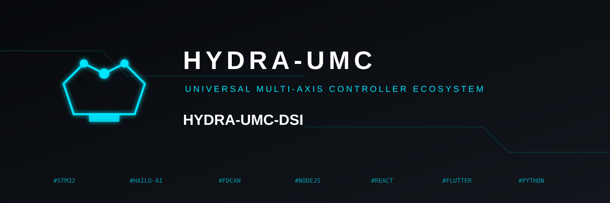

<p align="center">
  
</p>
# 🖥️ HYDRA-UMC DSI

<p align="center">
  <a href="README.md">🇺🇸 English</a> |
  <a href="README_spa.md">🇪🇸 Español</a> |
  <a href="README_fra.md">🇫🇷 Français</a> |
  <a href="README_ita.md">🇮🇹 Italiano</a> |
  <a href="README_deu.md">🇩🇪 Deutsch</a> |
  <a href="README_zho.md">🇨🇳 简体中文</a> |
  🇯🇵 <b>日本語</b>
</p>


<p align="left">
  
  
  
  
</p>


Compute Module 5 上の HYDRA-UMC 自身の 5"/7" DSI タッチスクリーン向けのネイティブ Flutter タッチ UI（Dart、実際の Linux デスクトップターゲット）——2 つの物理パネルサイズはまったく同じ 1280x720 ピクセル解像度を共有しているため、本アプリは 2 つのサイズに適応させるのではなく、1 つの固定された非レスポンシブレイアウトを提供します。[HYDRA-UMC SUITE](https://github.com/JuanenRac/HYDRA-UMC-SUITE)、[HYDRA-UMC-ANDROID-CONTROL](https://github.com/JuanenRac/HYDRA-UMC-ANDROID-CONTROL)、[HYDRA-UMC-IOS-CONTROL](https://github.com/JuanenRac/HYDRA-UMC-IOS-CONTROL) が使用しているのとまったく同じ [`REMOTE_API.md`](https://github.com/JuanenRac/HYDRA-UMC-STUDIO/blob/main/docs/REMOTE_API.md) 契約を話します——稼働中の [HYDRA-UMC STUDIO](https://github.com/JuanenRac/HYDRA-UMC-STUDIO) サーバーに対するディスカバリー、ログイン、原子的なロボットごとの指令、そしてリアルタイム WebSocket 同期を、ブラウザタブ経由ではなくボード自体の上で直接実行します。フルデザインは [`docs/ARCHITECTURE.md`](docs/ARCHITECTURE.md) を参照してください。Flutter を選んだ理由（Kivy ではなく）や、3D 画面が WebView ではない理由も含まれています。

**本アプリは、同じボード上に共存する 2 つの制御サーフェスのうちの 1 つです**——CM5 は、ブラウザ UI を実行する完全な外部モニター向けの HDMI 出力も同時に駆動します。この DSI アプリはそのパスを補完するもので、ボード自体に直接的で常時稼働するタッチコンソールを提供します。ブラウザ UI を置き換えるものではありません。

## 🏗️ 実装済みの内容

- **ログイン**（`lib/ui/login_screen.dart`、`lib/state/robot_view_model.dart`）—— タッチ操作向けに調整されたサーバー IP/ポート + ユーザー名/パスワードフィールド、`admin`/`admin` に対する `POST /api/login`（事前入力済み——本エコシステム内のすべてのサーバーが自身の初回起動時に用意するデフォルトアカウント。追加の低権限「オペレーター」アカウントはブラウザ UI の Config > Users から作成可能）、`shared_preferences` を通じて起動をまたいで永続化されるセッショントークン——アプリの再起動だけでなく CM5 の電源サイクルをまたいでもサインイン状態を維持することが期待されるキオスクパネルにとって重要です。「ローカルネットワークをスキャン」ダイアログ（`lib/network/discovery.dart`）は、IP を事前に知らなくてもサーバーを見つけられます——本アプリが動作している CM5 自体が、それが接続すべきまさにそのコントローラーであることが多いため、ここでは特に有用です。
- **ネットワークディスカバリー**（`lib/network/discovery.dart`）—— 同じ「ローカルネットワークをスキャン」ダイアログから 2 つの経路が並行して動作します：実際の mDNS/Bonjour（`discoverMdns()`、`multicast_dns` パッケージ経由で `server.ts` 自身が公開する `_hydra._tcp` を照会）と、このデバイス自身の実際のローカルサブネットに対する `GET /api/hydra-info` の並行総当たりスキャン（`scanSubnets()`）——host:port で重複排除。HYDRA-UMC-IOS-CONTROL から移植されたもので、同アプリは本エコシステムで最初に実際の mDNS ディスカバリーを追加したクライアントです。
- **原子的な指令同期**（`lib/state/robot_view_model.dart` 自身の `_sendAtomicCommand()`）—— すべての書き込み（有効化/無効化/再生/一時停止/停止/ジョグ/バルブ/ポンプ/速度/ビジョン）は、実際の `POST /api/robot/:id/command` エンドポイントを使用し、正しい統合ロボット（`combinedWith`）の伝播、およびリクエストが失敗した場合の変更前スナップショットへのロールバックを備えています——実際のロボットから数フィート離れた場所にあるジョグペンダント/緊急停止にとって特に重要です。
- **リアルタイム WebSocket 同期**（`lib/network/hydra_websocket.dart`）—— 常に `?token=` を付加し、`"settings"` と `"delta"` の両方のブロードキャストタイプを処理し、切断時には自動的に再接続します。
- **水平タッチナビゲーション**（`lib/ui/main_screen.dart`）—— 固定 1280px 幅にわたる、6 つの大きなアイコン+ラベルタブ（ダッシュボード/制御/カメラ/3D ビュー/指標/設定）からなる常設のトップバー。スマートフォン式のボトムナビゲーションバーというより、精神的には KlipperScreen に近いものです——プロジェクトオーナーが求めたカタログに一致させつつ、縦長のスマートフォンレイアウトではなく、横長のタッチパネル向けに再編成されています。
- **ダッシュボード**（`lib/ui/dashboard_screen.dart`）—— ロボットごとのカード、`Provider` によるリアルタイムの反応、LED の慣例（緑の点滅=アクティブ、赤の点灯=非アクティブ）、統合ロボット表示、モジュールチップ（CAM/XY/ATC/PNP/CNC/LSR/BED/VAC/RCK）——本エコシステム内の他のすべてのクライアントと同じビジュアル言語です。
- **手動制御**（`lib/ui/control_screen.dart`、`lib/ui/widgets/joystick_pad.dart`）—— 単一のスクロール列ではなく 1280x720 のフレームに合わせたサイズの左右配置レイアウト（左にジョグパッド、右にテレメトリ/速度/IO）、緊急停止/停止に対する実際の長押し保護（すばやいタップでは何も起こらず、触感+視覚的なヒントのみで、本当に長押しした場合にのみ指令が送信されます）、速度/加速度スライダー、バルブ/ポンプのトグル。
- **カメラ**（`lib/ui/camera_screen.dart`、`lib/ui/widgets/mjpeg_view.dart`）—— HYDRA-UMC-IOS-CONTROL と同じ、手作りで依存関係のない MJPEG ストリームパーサー（WebView なし、プラットフォーム固有コードなし——Linux デスクトップ上でそのまま動作します）、明確な「カメラ無効」状態、そしてサーバーから直接ロボットのビジョンシステムをオン/オフする切り替えスイッチ。
- **3D ビュー**（`lib/ui/three_d_screen.dart`）—— iOS/Android アプリとは異なり、STUDIO の実際の Three.js シーンを埋め込む WebView では**ありません**——`webview_flutter` には Linux デスクトップ実装がまったく存在せず、フルブラウザエンジンはこの低消費電力の組み込みパネルが必要とする以上に重いランタイム負荷になります。代わりに：小さなネイティブの等角 X/Y/Z 位置インジケーター（`CustomPainter`、3D エンジンなし）と、本ボード自身の HDMI 接続モニター上にある実際の 3D シーンを指し示す画面上の注記。完全な理由は `docs/ARCHITECTURE.md` 第 4 節を参照してください。
- **システム指標**（`lib/ui/metrics_screen.dart`）—— iOS/Android のようにダッシュボードに折りたたまれるのではなく、専用のタブを持ち、`GET /api/system/metrics` からの CPU/メモリ/温度/稼働時間タイルと、`GET /api/hydra-info` からのホスト名/コントローラー数/ロボット数/アプリバージョンを表示します。
- **設定**（`lib/ui/settings_screen.dart`）—— 接続情報、サーバー識別情報、サインアウト、そして本アプリ自身のバージョン（下記の[バージョン管理](#-バージョン管理)参照）。
- **キオスク自動起動**（`kiosk/hydra-umc-dsi.service`、`kiosk/install_kiosk.sh`）—— `cage` 経由で `tty1` 上に本アプリをフルスクリーン起動する systemd ユニット、`Restart=always`。詳細は下記「実際の CM5 上での実行」を参照してください。

**状態：雛形 + 全 6 のカタログ画面が実装され、実際の REMOTE_API.md 契約に接続済み。** `flutter analyze` はクリーン、`flutter build windows` は動作するバイナリを生成し、`flutter test` はパスします——この Windows 作業環境から何が検証でき何が検証できなかったかの正確な内容は、下記「ビルド」を参照してください。実際のターゲットは Linux であるためです。

## 🚀 ビルド

[Flutter SDK](https://docs.flutter.dev/get-started/install)（stable チャンネル）が必要です。本リポジトリは Flutter 3.47.0 に対してビルド/検証されています。本リポジトリでは `linux/` と `windows/` のみがプラットフォームとして設定されています（`android/`、`ios/`、`web/`、`macos/` フォルダはありません）——Linux が実際のターゲットです（CM5 自身の OS）。Windows は、Linux ツールチェーンのないマシンでもこのアプリ自身のロジックをビルド、実行、テストできるようにするためだけに存在します。

### ビルドスクリプト

```bash
./build.sh          # Git Bash / WSL、または cmd/PowerShell 用の build.bat —— flutter pub get + バージョン加算 + flutter build windows（開発機での検証）
./build_linux.sh    # 実際の Linux マシン（または CM5 自体）上で実行する必要があります —— flutter pub get + バージョン加算 + flutter build linux（実際のデプロイ先）
./run_dev.sh         # Git Bash / WSL、または cmd/PowerShell 用の run_dev.bat —— デスクトップシミュレーションモード（flutter run）、ハードウェア不要
```

3 つのビルドスクリプト（`build.sh`/`build.bat`/`build_linux.sh`）はすべて、最初にアプリのバージョンを加算します——下記の[バージョン管理](#-バージョン管理)参照。`run_dev.sh`/`run_dev.bat` は加算しません——このポリシーの下では、開発ループの `flutter run` は「実際のビルド」ではありません。

### 手動ビルド

```bash
flutter pub get
flutter analyze                  # 静的解析——コンパイラ不要
flutter test                     # ウィジェットテスト
dart run tool/bump_version.dart  # バージョンを加算、build.sh/build.bat/build_linux.sh が行うのと同じ
flutter build windows            # 開発機でのスモークテスト——build/windows/x64/runner/Release/hydra_umc_dsi.exe を生成
flutter build linux              # 実際のターゲット——実際の Linux マシン上で実行する必要があります。build/linux/*/release/bundle/ を生成
flutter run -d windows           # または実際の Linux マシン上で -d linux、ライブなデスクトップシミュレーション開発ループ用
```

**Linux 検証に関する正直な注記：** 本リポジトリは、Linux ビルドツールチェーンが利用できない Windows マシン上で作成されました（`wsl --status` で確認済み——WSL ディストリビューションはインストールされていません）。`flutter build linux` は、この作業環境からこのコードに対して実際に実行されたことは一度もありません。`flutter build windows` は、タスクが明示的に許可しているスモークテストの代替として使用されました。何が検証され何が検証されなかったかの正確なリストは `docs/ARCHITECTURE.md` 第 7 節を、フォローアップは `mejoras_futuras.txt` を参照してください。

## 🔢 バージョン管理

本リポジトリは、エコシステム全体で統一されたポリシーに従います（[HYDRA-UMC-IOS-CONTROL](https://github.com/JuanenRac/HYDRA-UMC-IOS-CONTROL) と共有され、そちらでも並行して実装されています）：バージョンは**実際のビルドのたび**に自動的に加算され、`pubspec.yaml` の `version:` 行を手動で編集する必要はありません。`build.sh`/`build.bat`/`build_linux.sh` は、`flutter build` を呼び出す前に `tool/bump_version.dart` を実行し、以下を適用します：

- **Patch、オドメーター方式（10 進法）：** 毎回のビルドで +1；9 を超えるとリセットされて 0 になり、代わりに minor が +1 されます——例：`0.0.9` -> `0.1.0`。Major は自動的には決して変更されません。
- **ビルド番号**（`+` の後の部分）：単純な単調カウンター、毎回のビルドで +1、繰り上がりなし。

同じスクリプトが `lib/app_version.dart`（生成物であり、手作業で編集されるものではありません——単純な `const` ファイルであり、`package_info_plus` のような新しいランタイム依存関係ではありません）を再生成し、アプリは実行時にこれを読み取って **Settings** 画面に自身のバージョンを表示します。バージョン履歴は [CHANGELOG.md](CHANGELOG.md) を参照してください。

### 実際の CM5 上での実行

`build_linux.sh` が `build/linux/*/release/bundle/` を生成したら、`bundle/` ディレクトリ全体を CM5 の `/opt/hydra-umc-dsi/bundle/` にコピーし（実行ファイル自体だけでなく、隣にある `.so` ファイルにも依存しているため）、`sudo kiosk/install_kiosk.sh` を実行して `kiosk/hydra-umc-dsi.service` をインストール・有効化してください。これは、[`cage`](https://github.com/cage-kiosk/cage)（ちょうど 1 つのフルスクリーンクライアントを実行する最小限の Wayland キオスクコンポジター）経由で `tty1` 上に本アプリをフルスクリーン起動する systemd ユニットで、`Restart=always` が設定されているため、クラッシュしても空白画面になるのではなく再起動されます。[`flutter-pi`](https://github.com/ardera/flutter-pi)（ウィンドウシステムをまったく使わずに動作する、Raspberry Pi 向けのサードパーティ製ベアメタル Flutter エンジン埋め込みツール）ではなくこちらが選ばれた具体的な理由は、`build_linux.sh` 自身の実際の `flutter build linux` 出力をそのまま再利用できるためです——flutter-pi は代わりに Flutter エンジンに対して直接ビルドするため、本リポジトリがすでに生成しているビルドにそのまま追加できるものではなく、独自の別個のビルドステップが必要になります。**正直な注記：** 記述・レビュー済みですが、実際の CM5 や他の Linux マシンに対して実際に実行されたことは一度もありません——`flutter build linux` 自体と同じ未検証の状態です（`docs/ARCHITECTURE.md` 第 7 節参照）。CM5 が実際に実行する Raspberry Pi OS イメージに対して確認が必要な正確な前提（root サービスユーザー、`tty1` の所有権）については、`kiosk/hydra-umc-dsi.service` 自身のヘッダーコメントを参照してください。

## 📂 リポジトリ構成

```text
HYDRA-UMC-DSI/
├── build.bat, build.sh              # flutter pub get + バージョン加算 + flutter build windows（開発機での検証）
├── build_linux.sh                   # flutter pub get + バージョン加算 + flutter build linux（実際の CM5 ターゲット——実際の Linux 上で実行）
├── run_dev.bat, run_dev.sh          # flutter run —— デスクトップシミュレーションモード
├── CHANGELOG.md                      # バージョン履歴（上記バージョン管理を参照）
├── kiosk/
│   ├── hydra-umc-dsi.service        # systemd ユニット——cage 経由のフルスクリーン自動起動
│   └── install_kiosk.sh             # 上記ユニットのインストール + 有効化（実際の CM5 上で実行）
├── tool/
│   └── bump_version.dart            # build.bat/build.sh/build_linux.sh が毎回のビルド前に実行するバージョン加算スクリプト（上記バージョン管理を参照）
├── lib/
│   ├── main.dart                    # アプリのエントリポイント、ChangeNotifierProvider + ログインゲート、固定ダークテーマ
│   ├── app_version.dart             # 生成物——tool/bump_version.dart によって再生成される、手動編集禁止
│   ├── models/
│   │   ├── server_info.dart         # ディスカバリー/接続エントリ——他の 3 つのクライアントの ServerInfo をミラーリング
│   │   └── hydra_state.dart         # RobotView/ControllerView/HydraState——生の settings.json ツリーに対する薄い可変ビュー
│   ├── network/
│   │   ├── hydra_api_client.dart    # REST：ログイン、設定、原子的ロボット指令、システム指標——X-Hydra-Client: dsi
│   │   ├── hydra_websocket.dart     # /ws リアルタイム同期クライアント
│   │   ├── discovery.dart           # このデバイス自身の実際のローカルサブネットの並行スキャン
│   │   └── auth_prefs.dart          # 永続化された接続情報 + トークン（shared_preferences）
│   ├── state/
│   │   └── robot_view_model.dart    # すべての画面がリッスンする単一の ChangeNotifier
│   └── ui/
│       ├── login_screen.dart        # ホスト/ポート/ユーザー/パスワードフィールド + 「ローカルネットワークをスキャン」
│       ├── main_screen.dart         # 水平タッチナビゲーションバー（6 タブ）——精神的には KlipperScreen に近い
│       ├── dashboard_screen.dart    # ロボットごとのカード + システム指標バー
│       ├── control_screen.dart      # ジョグ/速度/バルブ/ポンプ/再生制御、左右配置のタッチレイアウト
│       ├── camera_screen.dart       # MJPEG ビューアー + ビジョンオン/オフスイッチ
│       ├── three_d_screen.dart      # ネイティブの等角 X/Y/Z インジケーター——WebView ではない（docs/ARCHITECTURE.md §4 参照）
│       ├── metrics_screen.dart      # CM5 ホスト指標 + サーバー識別情報専用タブ
│       ├── settings_screen.dart     # 接続情報 + サインアウト + 自身のアプリバージョン
│       └── widgets/
│           ├── joystick_pad.dart     # ジョグ方向パッド、タッチ向けに拡大
│           ├── digital_readout.dart, status_led.dart
│           └── mjpeg_view.dart       # 手作りの MJPEG ストリームパーサー
├── linux/                            # GTK デスクトップランナー——実際のターゲット、固定 1280x720 ウィンドウ
├── windows/                          # Windows デスクトップランナー——開発機での検証専用
├── docs/ARCHITECTURE.md
├── test/widget_test.dart
├── README.md                         # 本ファイル
└── README_spa.md / README_ita.md / README_fra.md / README_deu.md / README_zho.md / README_jpn.md  # 翻訳
```

## 🔗 関連プロジェクト

本プロジェクトは、同一著者（JuanenRac／Electro Hobby 3D）による、はるかに大規模なロボティクスエコシステムの一部であり、コアプラットフォーム制御、ビジョンおよび認知 AI ノード、群制御オーケストレーション、デジタルツイン、データ分析、そして多数のプロジェクトにまたがる産業統合を扱っています。ご要望が実際にはこれらのプロジェクトのいずれかに関するものであり、本リポジトリのものではない可能性もあるため、知っておく価値があります。

**HYDRA-UMC DSI と直接関連**
- **[HYDRA-UMC-WATCH](https://github.com/JuanenRac/HYDRA-UMC-WATCH)** —— 本タッチパネルを補完するウェアラブル安全警報デバイスで、ボード自身の画面に加えて、操作員の手首にも警告を伝えます。
- **[HYDRA-UMC-COGNITIVE-NODE](https://github.com/JuanenRac/HYDRA-UMC-COGNITIVE-NODE)** —— 本タッチパネルに直接音声制御を追加します。
- **[HYDRA-UMC-VOICE-UI](https://github.com/JuanenRac/HYDRA-UMC-VOICE-UI)** —— 本タッチパネルに直接音声制御を追加します。

**エコシステムのその他のプロジェクト**

💠 **コアエコシステム**：[HYDRA-UMC](https://github.com/JuanenRac/HYDRA-UMC) · [HYDRA-UMC-SERVER](https://github.com/JuanenRac/HYDRA-UMC-SERVER) · [HYDRA-UMC-STUDIO](https://github.com/JuanenRac/HYDRA-UMC-STUDIO) · [HYDRA-UMC-SUITE](https://github.com/JuanenRac/HYDRA-UMC-SUITE) · [HYDRA-UMC-ANDROID-CONTROL](https://github.com/JuanenRac/HYDRA-UMC-ANDROID-CONTROL) · [HYDRA-UMC-IOS-CONTROL](https://github.com/JuanenRac/HYDRA-UMC-IOS-CONTROL) · [HYDRA-UMC-EDITOR-URDF](https://github.com/JuanenRac/HYDRA-UMC-EDITOR-URDF) · [URTC](https://github.com/JuanenRac/URTC) · [URTC-FLASHER](https://github.com/JuanenRac/URTC-FLASHER) · [URTC-TESTER](https://github.com/JuanenRac/URTC-TESTER) · [URTC-WEB-STUDIO](https://github.com/JuanenRac/URTC-WEB-STUDIO)

👁️ **ビジョン AI ノード（Hailo-8）**：[HYDRA-UMC-VISION-NODE](https://github.com/JuanenRac/HYDRA-UMC-VISION-NODE) · [HYDRA-UMC-VISION-STREAMER](https://github.com/JuanenRac/HYDRA-UMC-VISION-STREAMER) · [HYDRA-UMC-DETECTION-HEF](https://github.com/JuanenRac/HYDRA-UMC-DETECTION-HEF) · [HYDRA-UMC-SAFETY-ZONES](https://github.com/JuanenRac/HYDRA-UMC-SAFETY-ZONES) · [HYDRA-UMC-VISUAL-SERVOING-API](https://github.com/JuanenRac/HYDRA-UMC-VISUAL-SERVOING-API)

🧠 **認知 AI ノード（Hailo-10）**：[HYDRA-UMC-VLA-ENGINE](https://github.com/JuanenRac/HYDRA-UMC-VLA-ENGINE) · [HYDRA-UMC-SEMANTIC-PLANNER](https://github.com/JuanenRac/HYDRA-UMC-SEMANTIC-PLANNER) · [HYDRA-UMC-DOCS-QA](https://github.com/JuanenRac/HYDRA-UMC-DOCS-QA)

🐝 **オーケストレーションと群制御**：[HYDRA-UMC-ORCHESTRATOR](https://github.com/JuanenRac/HYDRA-UMC-ORCHESTRATOR) · [HYDRA-UMC-SWARM-SYNC](https://github.com/JuanenRac/HYDRA-UMC-SWARM-SYNC) · [HYDRA-UMC-PATH-PLANNER-3D](https://github.com/JuanenRac/HYDRA-UMC-PATH-PLANNER-3D) · [HYDRA-UMC-JOB-DISPATCHER](https://github.com/JuanenRac/HYDRA-UMC-JOB-DISPATCHER) · [HYDRA-UMC-NODE-HEALING](https://github.com/JuanenRac/HYDRA-UMC-NODE-HEALING)

🎮 **デジタルツインとシミュレーション**：[HYDRA-UMC-TWIN](https://github.com/JuanenRac/HYDRA-UMC-TWIN) · [HYDRA-UMC-PHYSICS-REPLICA](https://github.com/JuanenRac/HYDRA-UMC-PHYSICS-REPLICA) · [HYDRA-UMC-HIL-BRIDGE](https://github.com/JuanenRac/HYDRA-UMC-HIL-BRIDGE) · [HYDRA-UMC-SYNTHETIC-DATA-GEN](https://github.com/JuanenRac/HYDRA-UMC-SYNTHETIC-DATA-GEN)

📊 **データと分析**：[HYDRA-UMC-DATALAKE](https://github.com/JuanenRac/HYDRA-UMC-DATALAKE) · [HYDRA-UMC-TELEMETRY-COLLECTOR](https://github.com/JuanenRac/HYDRA-UMC-TELEMETRY-COLLECTOR) · [HYDRA-UMC-ANOMALY-DETECTOR](https://github.com/JuanenRac/HYDRA-UMC-ANOMALY-DETECTOR) · [HYDRA-UMC-PRODUCTION-REPORTS](https://github.com/JuanenRac/HYDRA-UMC-PRODUCTION-REPORTS)

🏭 **産業用ゲートウェイ**：[HYDRA-UMC-GATEWAY-INDUSTRIAL](https://github.com/JuanenRac/HYDRA-UMC-GATEWAY-INDUSTRIAL) · [HYDRA-UMC-OPCUA-SERVER](https://github.com/JuanenRac/HYDRA-UMC-OPCUA-SERVER) · [HYDRA-UMC-MQTT-BROKER](https://github.com/JuanenRac/HYDRA-UMC-MQTT-BROKER) · [HYDRA-UMC-MTCONNECT-ADAPTER](https://github.com/JuanenRac/HYDRA-UMC-MTCONNECT-ADAPTER)

🛠️ **補完ツール**：[URTC-SMART-RACK](https://github.com/JuanenRac/URTC-SMART-RACK) · [URTC-VISION-TOOL](https://github.com/JuanenRac/URTC-VISION-TOOL) · [HYDRA-UMC-TOOL-CLI](https://github.com/JuanenRac/HYDRA-UMC-TOOL-CLI) · [HYDRA-UMC-DASHBOARD-AI](https://github.com/JuanenRac/HYDRA-UMC-DASHBOARD-AI)

---

## 👤 作者
**JuanenRac** (Electro Hobby 3D)
📧 electrohobby3d@gmail.com
📺 [youtube.com/@electrohobby3d](https://youtube.com/@electrohobby3d)

## 📜 ライセンス

ソースコードは **GNU General Public License v3.0（GPL-3.0）**——[`LICENSE`](LICENSE) を参照してください。

ドキュメント（本 README およびその自身の翻訳版——`README_spa.md`、`README_ita.md`、`README_fra.md`、`README_deu.md`、`README_zho.md`、`README_jpn.md`）は、**クリエイティブ・コモンズ 表示-継承 4.0 国際（CC BY-SA 4.0）** の下で提供されます。全文は https://creativecommons.org/licenses/by-sa/4.0/ を参照してください。
